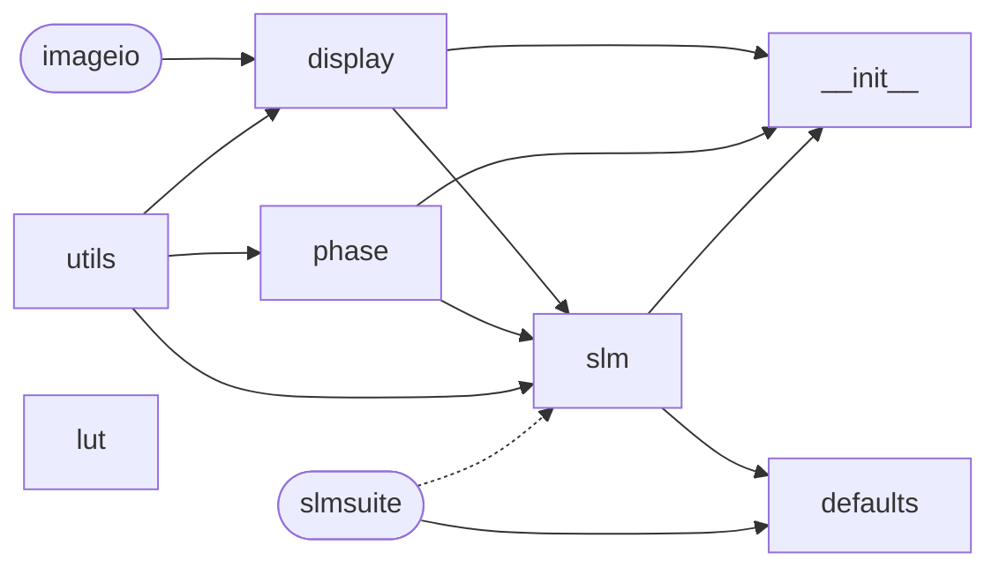

Dependency chart of the `slmutils.generate` submodule for quick reference. Solid arrows point from the imported module, with dashed arrows indicating lazy imports. Rounded rectangles represent external modules.
More universal imports like `numpy` are generally included, and thus excluded from this dependency chain.




Note that imported `slmsuite` is very expensive, and is hence done lazily by scoping it to within the function.
This should be migrated to modern methods of aligning with type checking, either of:

1. Use `importlib.util.LazyLoader` for lazy loading, with type stubs for type checking.
2. Use Python 3.15+ `lazy import` syntax (which is unlikely given the Python 3.10 dependency of `spinnaker-python`).

For the first method, the type stub would be stored in `slm.pyi`:

```python
import slmsuite.hardware.slms.simulated as simulated_slm
import slmsuite.holography.toolbox as toolbox
import slmsuite.holography.toolbox.phase as analytic

__all__ = [
    "analytic",
    "simulated_slm",
    "toolbox",
]
```

and in the module `slm.py` itself:

```python
import importlib.util
import warnings
import sys

def lazy_import(name):
    # Avoids duplicate module loading
    if name in sys.modules:
        return sys.modules[name]

    with warnings.catch_warnings():
        warnings.simplefilter("ignore", category=UserWarning)
        spec = importlib.util.find_spec(name)

    if spec is None or spec.loader is None:
        print(f"Module '{name}' does not exist - not imported.")
        raise ModuleNotFoundError

    loader = importlib.util.LazyLoader(spec.loader)
    spec.loader = loader
    module = importlib.util.module_from_spec(spec)
    sys.modules[name] = module
    loader.exec_module(module)
    return module

analytic = lazy_import("slmsuite.holography.toolbox.phase")
toolbox = lazy_import("slmsuite.holography.toolbox")
simulated_slm = lazy_import("slmsuite.hardware.slms.simulated")
```
